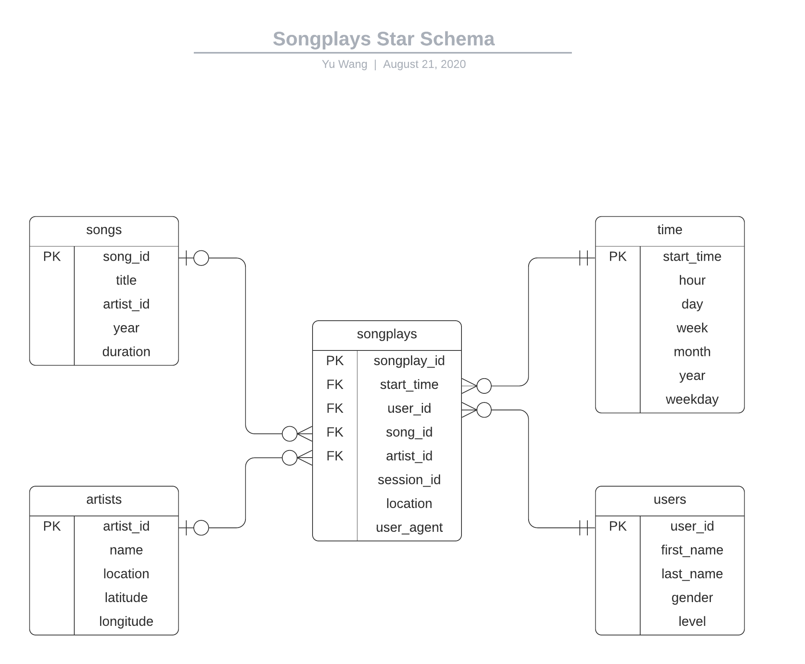
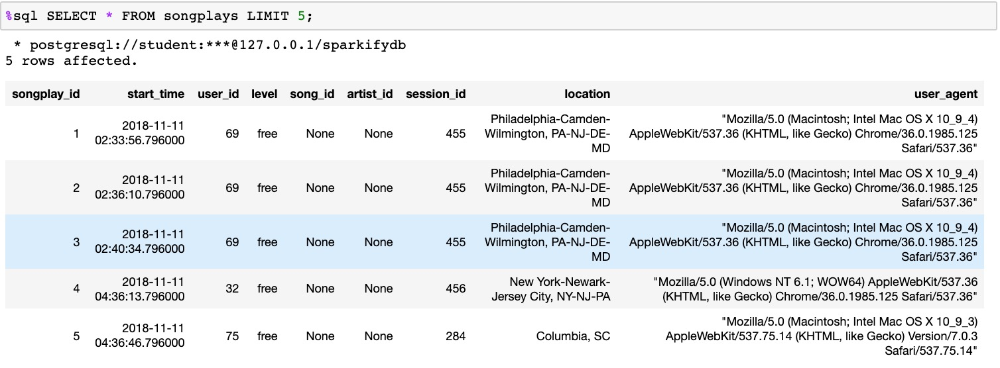
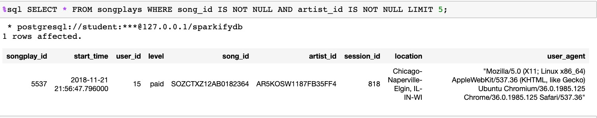
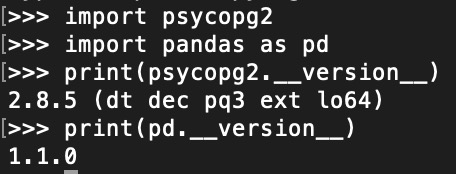
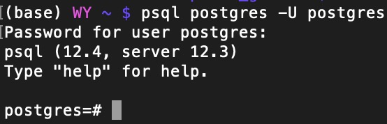
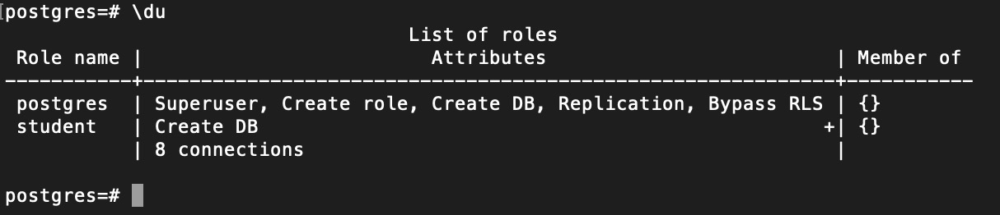
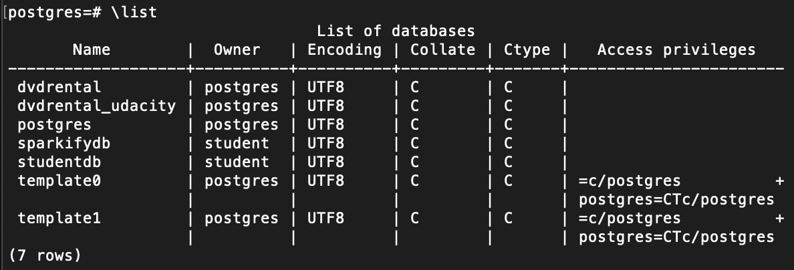
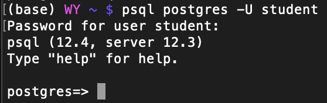
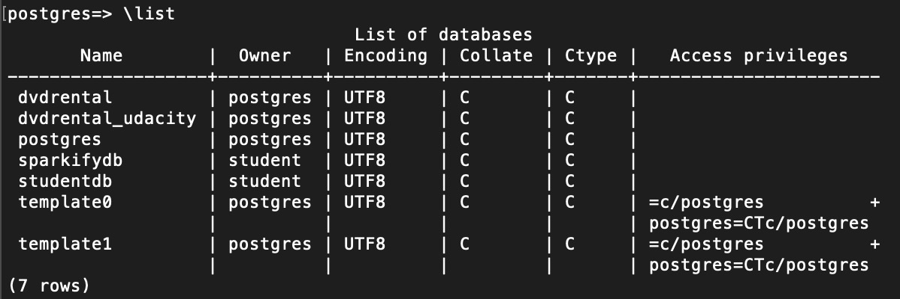

# Data Engineer Nanodegree Subproject
The repository contains the project information of the **Data Modelling with Postgres** from Udacity Nanodegree 
**[Data Engineer](https://www.udacity.com/course/data-engineer-nanodegree--nd027)**. Please refer to the 
course [website](https://www.udacity.com/course/data-engineer-nanodegree--nd027) for more details. 

Project scenario: A startup called Sparkify wants to analyze the data they've been collecting on songs and 
user activity on their new music streaming app. 

Project goals: Build a database using Postgres and write an ETL pipeline to transfer raw data (*JSON*) to 
database tables for analytic purposes.

## Business Process / Data Requirements
- Analytics team wants to understand **what songs** their **users** are listening to.
- Analytics team wants a **Postgres DB** with tables designed to **optimize queries** on song play analysis.

## Engineering Task
- Create a Postgres DB schema and ETL pipeline for the analysis
  - Explore & import raw data from *JSON* files given by the project
  - Define fact & dimension tables for a star schema for this particular analytic purpose
  - Write an ETL pipeline that imports and transfers data from *JSON* files to tables in Postgres DB
- Test database and ETL pipeline by running some test queires

## Tools Used
- Python 3
- SQL
- [Pandas](https://pandas.pydata.org/docs/index.html#)
- [Psycopg2](https://pypi.org/project/psycopg2/)
- [Postgres DB](https://www.postgresql.org/)
- [LucidChart](https://www.lucidchart.com/)

## Original Data Sources
**Note** that the actual data (in *JSON*) used in this project is a subset of original dataset preprocessed by the course.
1. [Million Song Dataset](http://millionsongdataset.com/)
2. [Event Simulator](https://github.com/Interana/eventsim) based on [Million Song Dataset](http://millionsongdataset.com/)

## Database Schema (Data Warehousing) Design
**User Story**: User *user_id* plays a *song* whose artist is *artist_name* at time *start_time* using *agent*. 
From the above story, we can extract some necessary information/dimentions:

- **Who**: *user* dimension
- **What**: *songs* and *artists* dimension
- **When**: *time* dimension
- **How (many)**: songplay fact
- (More possible dimensions but not used in this project):
	- **Where**: *geo-locations* dimension
	- **How**: *agents* dimension

Since the core business process/metric is an user playing a song, the fact table should store the song play records with 
user/song identifier together with related information about the how and where the song is played. Based on the data and tables 
given in the project, the star schema looks like this (generated using [LucidChart](https://www.lucidchart.com/)):

## ETL Process
1. Extract songs data from corresponding *JSON* files and insert them into dimension tables:
 	- *songs*
  	- *artists*
2. Extract users and time data from corresponding *JSON* files and insert them into dimension tables:
  	- *users*
  	- *time*
3. Extract song play records from corresponding *JSON* files and insert them into fact table (and make sure to conform to entity relation constraints):
  	- *songplays*
4. Test the entire ETL process and runing some queries.

## Usage and Sample Results
Usage:
1. Make sure all packages are installed and Postgres is configured with username **student**, 
see section **Implementation Details/Notes** below for more details.
2. Execute ``create_tables.py`` to drop existing database and tables and create new ones.
3. Execute ``etl.py`` to run the ETL process and load data to database tables.
4. Open ``test.ipynb`` in python notebook to verify results. 

Additional files:
- ``sql_queries.py`` implements all sql queries in this project including creating/droping tables,
inserting records into tables, etc.
- ``etl.ipynb`` is a step-by-step guide to create the complete ETL process. 

Some of the sample results after running ``test.ipynb``:
1. Result 1 
 
1. Result 2 
 

## Implementation Details/Notes
* Explicitly declear **FOREIGN KEY** to enforce referential integrity and improve performance, 
check this [link](https://www.linkedin.com/pulse/importance-foreign-key-constraint-tim-miles/)
* Use Standard DataTime format: ``YYYY-MM-DD HH:MM:SS.SSSSS``
* song duration (decimal, per song): ``song_len <= 24 hours``
* latitude range (decimal): ``-90 <= lat_val <=  +90``
* longitude range (decimal): ``-180 <= long_val <= +180``
* hour (int): ``0 <= hour <= 23``
* day (int, leap year has 366 days, the last day being at 365th): ``0 <= day <= 365``
* week (int, 52 weeks in total plus one/two days, ceiling to 53 weeks): ``0 <= week <= 52``
* month (int): ``1 <= month <= 12``
* year (int, the earliest recorded songs were made after 1800s according to [wikipedia](https://en.wikipedia.org/wiki/Sound_recording_and_reproduction) and 
assuming artists and users in the database were not born before 1800s)
	* year from *songs* table ``year >= 1800`` **or** ``year == 0`` (default if not specified)
	* year from *time* table: ``year >= 1800``
* weekday (int): ``0 <= weekday <= 6``
* first/last name of users length: ``1 <= len <= 100``
* artist name length: ``1 <= len <= 200``
* foreign keys should not be ``NULL``, however it will result in producing only one record in fact table *songplays*. Therefore, relaxing the constraints to have only 
attributes ``start_time`` and ``user_id`` as ``NOT NULL`` in fact table *songplays*.

## Run project locally (Mac)

- Install Postgres Database 
``brew install postgresql``
- Check if Postgres is installed successfully 
``postgres -V``
 
- Install packages
	- Using pip command 
 	``pip install psycopg2`` 
 	``pip install pandas``
	- **Or** Using conda environment 
 	``conda install psycopg2`` 
 	``conda install pandas``
- Check packages installed successfully
 
- (Re) Start Postgres services 
``brew services start postgresql``
 
- Check Postgres Users/DBs
	- Log in as user **postgres**: ``psql postgres -U postgres``
 	 
 	- Display all users/roles: ``\du``
 	 
 	 I have already created **student** user in this example.
 	- Display all existing databases: ``\list``
 	 
 	 I have already created databases **studentdb** and **sparkifydb** in this example.
 	- Log out: ``\q``
 	 
- Create a new user using following arguments: 
	- username: **student** 
	- number of connections (max): **8** 
	- current username (with privilege of creating new users/roles): **postgres** 
``createuser -c 8 -d -P -U postgres student`` 
Remember to set **password** as **student**
- Create default database **studentdb** with owner/user **student** 
``createdb studentdb -U student``
- Verify the creation of user and database 
	- Log in as user **student**: ``psql postgres -U student``
 	 
 	- List databases:``\list``
 	 
- Now you can run the scripts and python-notebooks in this project

## TODOs
1. Use parallel processing to process songs data (take care of duplicate rows in *artists* and *songs* tables)
2. Use parallel processing to process songplay data (take care of duplicate rows in *users* and *time* tables)

## Resources
1. Setup Postgres on Mac: [Getting Started with PostgreSQL on Mac OSX](https://www.codementor.io/@engineerapart/getting-started-with-postgresql-on-mac-osx-are8jcopb)